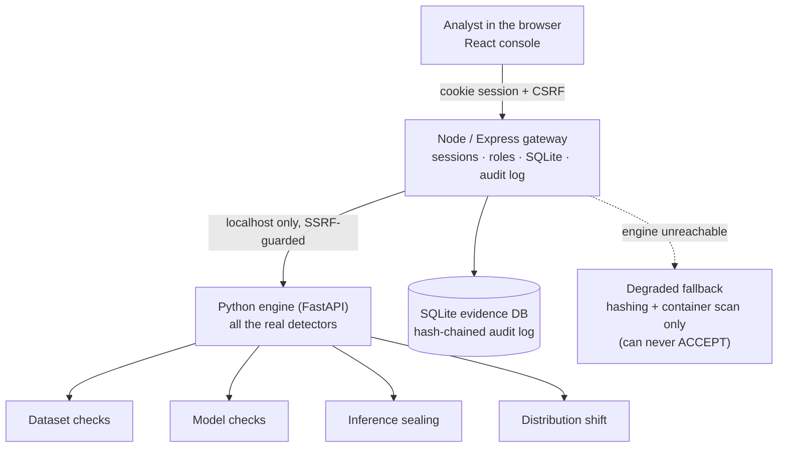
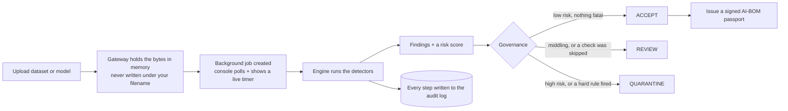
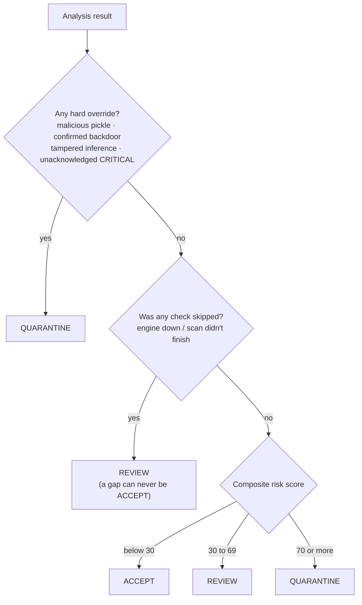
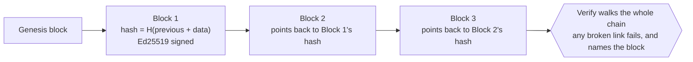

<p align="center">
  
</p>

<p align="center">
  
  
  
  
  
  
</p>

# TrustVision

**Smart India Hackathon 2026 · Problem SIH26228 · Ministry of Defence / Indian Army (DGIS)**

TrustVision is a tool that answers one hard question: **can you trust this computer-vision
pipeline?** Not just the model file, but the **dataset** it learned from, the **model** itself,
and the **predictions** it makes in the field. You hand it an asset, it runs a full battery of
checks, and it gives you one clear verdict — **ACCEPT, REVIEW, or QUARANTINE** — with all the
evidence written to a tamper-proof log.

It is built to run on **one machine, with no internet**. In a defence setting the thing you are
inspecting may itself be hostile, so the inspector must never phone home. Everything stays on the
node.

> One idea shapes the entire project: **"we found no problem" and "we could not run the check" are
> two very different sentences.** Most tools blur them. TrustVision always tells you which one it
> means — and a check it could not finish is never allowed to produce an ACCEPT.

---

## Overview — the big picture

Think of TrustVision as a **security checkpoint for AI**. A modern vision system is a supply chain:
data comes from many contributors, a model is trained and passed around as a file, and that model
makes live decisions. Each link can be poisoned — a hidden trigger in the data, a backdoor baked
into the weights, a tampered prediction. TrustVision inspects every link and leaves a signed paper
trail behind each decision.

Three things make it fit for a defence node:

- **Air-gapped by design.** No cloud, no telemetry, no outbound calls. It listens only on
  `127.0.0.1` (this machine). Nobody on the network can reach it.
- **Honest about its own limits.** Every result states *how deeply it could actually look*. A shallow
  check is never dressed up as a deep one.
- **Tamper-evident.** Every action is written to a hash-chained, digitally signed log that the
  database itself refuses to edit or delete.

You can run it two ways: as a **zero-install Windows app** (double-click and go, fully offline), or
**from source** for development. Both are covered below.

---

## How it works — the architecture

Two programs run side by side on the same computer and talk only over `localhost`:

- A **Node / Express gateway** — the front door. It serves the web console you log into, holds the
  SQLite database, keeps the signed audit log, manages users and roles, and does all the security
  gatekeeping (sessions, CSRF, validation).
- A **Python engine (FastAPI)** — the brain. It runs every real detector: the deep-learning models,
  the image math, the cryptography.



The split is deliberate. The gateway owns everything durable and everything the browser touches. The
engine owns every judgement call and never listens beyond `localhost`. The **only** outbound request
in the whole system is the gateway calling its own local engine — and even that is locked to
loopback and re-checked on every single call. If the engine is switched off, the gateway keeps
running but drops to a clearly-labelled **degraded mode** on every screen. It will never quietly pass
off a shallow check as a deep one.

---

## The MVP

The smallest version that actually works and proves the whole point:

> **Sign in → upload a dataset archive or a model file → the engine inspects it → you get an
> ACCEPT / REVIEW / QUARANTINE verdict backed by findings → issue a signed passport for it → every
> step is recorded in a log you cannot edit.**

Everything in this table is built and working today. Nothing here is a promise for later.

| Capability | What it does | Status |
|---|---|---|
| **Dataset inspection** | Finds duplicate-flooding, flipped labels, hidden backdoor triggers (and shows you the recovered trigger patch), out-of-distribution samples, corrupt files, and which contributor is responsible | ✅ Built |
| **Model inspection** | Reads a checkpoint *without running its pickle*, hunts backdoors two independent ways, checks the weights, and reports how deeply it could look (white-box / grey-box / black-box) | ✅ Built |
| **Inference provenance** | Seals a prediction into a signed record, then proves whether it was later tampered with, forged, or replayed | ✅ Built |
| **Distribution shift** | Compares two image sets and separates normal drift (lighting, weather) from deliberate manipulation | ✅ Built |
| **Governance decision** | Turns all of the above into ACCEPT / REVIEW / QUARANTINE with fixed thresholds and hard override rules | ✅ Built |
| **Tamper-proof audit log** | A hash-chained, signed, append-only ledger the database itself refuses to edit or delete | ✅ Built |
| **Signed passports (AI-BOM)** | Export a portable, signed `.aibom.json` for an analysed asset that anyone can verify offline | ✅ Built |
| **Separate workspaces per operator** | Each user sees only their own uploads and dashboard; the log and passport verification stay shared | ✅ Built |
| **Zero-install Windows app** | The whole system packaged as a self-contained folder — no Python, no Node, no installer — that runs offline on any Windows 10/11 machine | ✅ Built |

---

## What happens when you upload something

Analysis runs as a **background job**. The moment you upload, the console gets a job ticket and
starts polling for the result, showing a live timer. That means a big file can take its time on the
CPU without the screen ever looking frozen — and you can move to another tab and come back.



A quick word on speed, because it matters for large models: the heaviest step is gradient-based
trigger inversion. A normal classifier (say a CIFAR-scale model) finishes in well under a minute; a
very large many-class model is scanned within an interactive time budget and any part it could not
cover is **stated plainly** in the findings, never hidden. The behavioural backdoor detector always
runs in full.

---

## The five things it checks

### 1 · Datasets

| What we look for | How |
|---|---|
| Exact duplicate flooding | Group byte-identical images by SHA-256 |
| Near-duplicate flooding | Perceptual hash (pHash) + BK-tree search (Hamming ≤ 5), confirmed by ResNet-18 embedding cosine > 0.98 |
| Flipped labels | k-nearest-neighbour cross-check in feature space, with class-pair flow to tell targeted flipping from ordinary annotation noise |
| Backdoor triggers | Per-class and whole-corpus residual analysis with a statistical clustering test — and it recovers and **shows you the actual trigger patch** |
| Out-of-distribution samples | Mahalanobis distance to class centroids (Ledoit–Wolf shrunk covariance) |
| Corrupt / mislabelled files | Real decode check + magic-byte vs extension match; COCO/YOLO schema checks |
| Unsafe archives | Zip-Slip, decompression bombs, symlink escape — caught before extraction |
| Bad contributors | Rolls every defect up to a per-source risk score |

### 2 · Models

| What we look for | How |
|---|---|
| Malicious pickle | Disassembles the pickle opcodes **without executing them**, checks every import against an allowlist, and **fails closed** on a broken/truncated stream (the trick the Feb-2025 *nullifAI* samples used) |
| Structural trojans | ONNX graph inspection (works even without the `onnx` package, via a built-in protobuf reader) |
| Weight anomalies | NaN/Inf, dead tensors, outlier neurons, near rank-1 spectra |
| Backdoors (behaviour) | A battery of known trigger stamps run through the model; scored on how hard and how consistently they push inputs to one class. Works on PyTorch **and** on ONNX (via onnxruntime) |
| Backdoors (trigger inversion) | **Neural Cleanse** — optimises a mask/pattern per class. Used **only to corroborate** the behavioural battery, because on synthetic images it false-positives too often to be trusted alone. Not available for ONNX (no gradients), which we say out loud rather than skip silently |

Every model result also states its **access mode** — `WHITE_BOX`, `GREY_BOX`, `BLACK_BOX`, or
`REFUSED` — so a clean verdict always comes with "…and here is how deep we could actually see."

### 3 · Inference provenance

Binds the input hash, model hash, preprocessing config, prediction, timestamp, and a nonce into one
canonical document (RFC 8785), hashes it (SHA-256), and signs it (Ed25519). When you verify later,
you get one of four honest answers:

| Result | Meaning |
|---|---|
| `VERIFIED` | hash and signature both hold |
| `TAMPERED` | a bound field changed — it **names which fields** |
| `FORGED` | the hash matches but the signature does not — someone recomputed the hash without the key (a hash-only scheme would miss this) |
| `REPLAYED` | intact, but the nonce was already used, or the same input+model gave a different answer before |

### 4 · Distribution shift

Uses MMD (RBF kernel + permutation test), plus per-dimension KS and PSI on class priors. The hard
part the problem statement asks for — telling normal drift from tampering — is handled by measuring
how *concentrated* the shift is (a few samples moved a lot vs the whole batch moved a little) and
whether it disappears once you account for lighting/contrast/colour. HIGH severity is reserved for
shift that is both real and unexplained.

### 5 · Governance and the audit log

Covered in the next two sections.

---

## The decision: ACCEPT, REVIEW, or QUARANTINE

Thresholds are fixed by the problem statement: **ACCEPT below 30, REVIEW 30–69, QUARANTINE 70 and
up.** But some conditions are fatal on their own and are checked *before* the score — because
averaging one catastrophic flaw against four healthy scores is exactly how a bad asset slips
through.



Two things worth calling out:

- **The decision is per-asset.** A malicious model uploaded next to a clean dataset cannot drag the
  clean one down — each asset is judged on its own evidence.
- **No silent degradation.** If the Python engine is unreachable, the gateway runs a reduced fallback
  (hashing + container/pickle scan), records it in the audit log, shows a banner, and caps the verdict
  at REVIEW. A degraded run is a *gap*, never a clean bill of health.

---

## The audit log — "wait, is this a blockchain?"

Short answer: **no, and we will not call it one.** It is a hash-chained, signed, append-only log in a
single SQLite database. There is no peer-to-peer network, no consensus, no mining, no second node
agreeing with the first. Calling that a "blockchain" would be overselling it.

What it *is* is genuinely tamper-evident:



Each block includes the previous block's hash, so changing an old entry breaks every entry after it.
The database has triggers that **refuse UPDATE and DELETE** on the log table, so even a compromised
part of the app cannot rewrite history. Verification is fail-closed: a missing hash, a gap in the
sequence, or a bad signature all count as a break, and it points at the first block that failed.

---

## Keys, accounts, and separate workspaces

**The keys.** On first run the node creates its own cryptographic keys and keeps them on disk in the
`data/keys/` folder — Ed25519 signing keys for the audit log and for passports, generated locally and
never shipped inside the app. A separate per-install session secret lives in `data/auth_secret.txt`.
Everything the node produces stays inside its own `data/` folder: the evidence database, the keys, and
every issued passport. Back that folder up to keep your work; delete it to start clean.

**Why a passport verifies anywhere.** A signed AI-BOM passport carries its **own public key and
signature inside the file**. Verification is pure cryptography against that embedded key — not a
lookup in anyone's database — so a passport issued on one node verifies on any other node, fully
offline. Verification also tells you whether the signer is *this* node or a different one, by matching
fingerprints.

**Accounts and roles.** You can create several operator accounts, and each gets its **own private
workspace** — their uploads, analyses, findings, and dashboard are theirs alone and never bleed into
anyone else's. What stays shared, on purpose, is the audit log and the signing key, because that is
what makes passports portable. Accounts come from the environment, never hard-coded: point
`AIA_SEED_USERS_FILE` at a JSON file (kept out of git) and they are created on boot, or run
`npm run seed:users`. Roles range from a read-only observer up to a lead engineer, and each role has
an explicit list of what it is allowed to do.

---

## The pages

| Page | What it is for | What you upload |
|---|---|---|
| **Dashboard** | The node's overall verdict, risk pillars, open findings, recent log events | Nothing — it summarises |
| **Dataset integrity** | Inspect a dataset; see duplicates, label issues, recovered triggers, OOD, contributors | A dataset archive (`.zip`/`.tar`, COCO/YOLO/ImageFolder) or a single image |
| **Model integrity** | Inspect a checkpoint; pickle audit, backdoor battery, Neural Cleanse, weight stats | A model file (`.pt`, `.pth`, `.onnx`, `.ts`, `.safetensors`, `.bin`) |
| **Inference provenance** | Seal a prediction, then tamper with it in the "lab" and watch verification catch it | Nothing — you fill in form fields |
| **Distribution shift** | Compare a baseline image set against an operational one | Two sets of images (descriptors are computed in your browser; the images do not leave it) |
| **Audit & reports** | Read the log block by block, verify the chain, generate a signed report | Nothing |
| **Model passport (AI-BOM)** | Issue a signed passport from an analysis; verify any pasted passport | Paste passport JSON to verify (including one from another node) |
| **Live monitoring (Sentinel)** | Status board for the read-only sensor agents | Nothing |
| **Analytics** | Risk trends and breakdown charts from this node's own records | Nothing (empty node = empty charts, no fake data) |
| **Settings** | Engine endpoint, signing key info, roles, password change | Nothing |
| **Methodology** | Plain explainer of how each detector works | Nothing |

---

## Does it actually catch things? (ground truth)

The detectors are scored against a labelled corpus built from **real CIFAR-10** data with a
**genuinely fine-tuned backdoor** (99.99% attack success, 85.9% clean accuracy — good enough to pass
ordinary validation, which is exactly what makes it dangerous). Accuracy is measured on the test
split the models never saw.

| Asset | Ground truth | Verdict |
|---|---|---|
| `backdoored_model.pth` | BadNets corner trigger → class 0 | **DETECTED** — the behavioural battery drives ~99% of inputs to class 0 → QUARANTINE. Neural Cleanse only corroborates when it agrees on a class |
| `clean_model.pth` | clean, ~86% accuracy | **not flagged as a backdoor** — low risk, ACCEPT. Neural Cleanse raises an uncorroborated LOW *lead* on synthetic data — recorded for an analyst, never treated as a detection |
| `malicious_model.pth` | `os.system` via pickle | **DETECTED** — risk 100, never deserialised |
| `nullifai_model.pth` | payload + broken stream | **DETECTED** — risk 100 |
| `backdoored_model.onnx` | same backdoor, ONNX | **DETECTED** — behavioural battery via onnxruntime names class 0; trigger inversion declared unavailable (no gradients in ONNX) |
| `poisoned_corpus.zip` | 36 triggers, 34 floods, 28 flips | **DETECTED** — triggers recovered; the hostile contributor outranks the clean one |
| `clean_corpus.zip` | clean CIFAR-10 | ACCEPT — no trigger clusters |

Run it yourself: `python ml-engine/scripts/make_demo_assets.py`, then
`python -m pytest ml-engine/tests/test_ground_truth.py -v`.

> This suite exists because it once caught us out. An earlier build guessed a model's input size from
> its first layer; on these assets that flipped the results — a clean verdict on the real backdoor and
> a CRITICAL on the clean model. Every unit test still passed. Only a labelled corpus catches that
> kind of bug.

---

## Frameworks

Grouped by where it runs. Versions are exactly what is pinned in `package.json` and
`ml-engine/requirements.txt` (the Python side uses `>=` floors on purpose, so a security patch can be
applied without editing the file).

| Layer | Framework | Version | Role |
|---|---|---|---|
| **Frontend** | React + React DOM | 19.3.0 | The console UI |
| | Tailwind CSS (+ Vite plugin) | 4.1.14 | Styling |
| | Radix UI (dialog, tabs, tooltip, …) | 1.x–2.x | Accessible UI primitives |
| | Motion | ^12.23 | Animation |
| | Recharts | 3.10.1 | Analytics charts |
| | lucide-react | 0.546.0 | Icons |
| **Gateway** | Node.js | ≥ 22.5 | Runtime |
| | Express | 4.22.3 | HTTP server / routing |
| | `node:sqlite` | built-in | Embedded database (no native build step) |
| | multer | 2.4.0 | In-memory file uploads |
| | zod | 3.25.76 | Request validation |
| | dotenv | 17.4.2 | Config from `.env` |
| **ML engine** | Python | ≥ 3.10 | Runtime |
| | FastAPI + uvicorn | ≥ 0.115 / ≥ 0.30 | The analysis API |
| | PyTorch + torchvision | ≥ 2.2 / ≥ 0.17 | Backbone, behavioural battery, Neural Cleanse (CPU wheels are enough) |
| | NumPy / SciPy / scikit-learn | ≥ 1.26 / ≥ 1.11 / ≥ 1.4 | The detector math |
| | Pillow | ≥ 10.3 | Image decoding |
| | cryptography | ≥ 42 | Ed25519 signing |
| | onnx / onnxruntime | ≥ 1.16 / ≥ 1.18 | Optional — ONNX graph + behavioural checks |
| **Build / test** | Vite · esbuild · tsx · TypeScript | 6.4.3 · 0.25.12 · 4.21.0 · 5.8.3 | Dev server, bundling, TS runner, types |
| | pytest | ≥ 8 | Python tests |

Signing (Ed25519), hashing (SHA-256), password KDF (scrypt) and RFC 8785 canonicalisation use Node's
built-in `crypto` and Python's `cryptography` — no home-made crypto anywhere.

---

## Run it — two ways

### Option A · The Windows app (zero install, fully offline)

The easiest way, and the one to hand to a teammate. The whole system is packaged into one
self-contained folder that carries **its own Python + PyTorch engine and its own Node runtime**, so it
runs on any 64-bit Windows 10/11 machine with **nothing to install** and **nothing touching the
internet**.

1. Get the folder — either build it (below) or unzip `TrustVision-Windows.zip`.
2. Double-click **`TrustVision.vbs`**.
3. First time only, Windows may say *"Windows protected your PC"* (the app is not code-signed) →
   **More info → Run anyway**.
4. It opens in its own app window after a few seconds (the first launch is slower while the engine
   warms up).
5. Sign in as **`admin` / `TrustVision#2026`**, or pick the no-password **read-only evaluation
   session**. Change the admin password in Settings after first login.
6. To shut it down, double-click **`Stop TrustVision.vbs`**.

Your data lives in the `data/` folder next to `TrustVision.vbs` (evidence database, keys, passports).
It listens only on `127.0.0.1`; no one else on the network can reach it. Needs roughly 2 GB of free
RAM for model analysis.

To build the bundle from source (produces `build/TrustVision-Windows.zip`):

```powershell
powershell -ExecutionPolicy Bypass -File deploy\windows\build-windows-app.ps1
```

### Option B · From source (for development)

You need **Node.js 22.5+** and **Python 3.10+**.

```bash
npm install
```
```bash
python -m pip install -r ml-engine/requirements.txt
```

Stage the reference backbone once (needs network; then ship the file to an offline node). Skip it and
embedding checks run in a weaker mode that says so — nothing breaks:

```bash
python ml-engine/scripts/provision_backbone.py
```

Start the engine first, then the console (two terminals):

```bash
npm run ml
```
```bash
npm run dev
```

Open <http://127.0.0.1:3000>. **How you sign in depends on the bootstrap settings:**

- If you set `AIA_BOOTSTRAP_USER` / `AIA_BOOTSTRAP_PASSWORD` (the Windows app sets `admin` /
  `TrustVision#2026`), that is your admin login.
- If you do not, the **first boot prints a one-time random password** for `assurance.lead` to the
  terminal, and that account must change it at first login. There is no hidden default.

To create your team's accounts, put them in a gitignored `seed-users.json` (see
`seed-users.example.json`) and run:

```bash
npm run seed:users
```

Account recovery is deliberately a local, physical-access job (no network reset endpoint):

```bash
npx tsx scripts/admin.ts list
npx tsx scripts/admin.ts reset assurance.lead
```

---

## Tests

```bash
npm test          # Node / gateway suite (73 tests in this build)
npm run test:py   # Python engine suite (167 tests in this build)
npm run verify    # typecheck + both suites in one pass
```

The Node suite covers canonicalisation, per-asset governance scoping, audit-chain tamper-evidence,
passport verification, persistence, and per-user isolation. The Python suite covers the detectors,
provenance, shift, security (pickle + archives), and the multipart parser. Two heavier suites — the
real gateway↔engine integration test and the CIFAR-10 ground-truth scoring — run when their
prerequisites are present and skip cleanly otherwise (start the engine, or generate the demo assets,
to run them).

---

## Deploying it on a server

The Windows app above is the simplest way to run TrustVision on any single machine. For a hardened
server deployment, the full walkthrough is in **[DEPLOY.md](DEPLOY.md)**. The short version:

- **The hardened deployment** is one Docker container running both processes over loopback
  (`deploy/Dockerfile` + `deploy/docker-compose.yml`), or the same under systemd
  (`deploy/trustvision.service`). Read-only rootfs, all Linux capabilities dropped, evidence in a
  persistent volume.
- **To share a live link for testing**, put Caddy in front for automatic HTTPS on your domain
  (`deploy/docker-compose.public.yml`), or run a Cloudflare/ngrok tunnel to your machine.
- **A tunnel link only works while your machine and the app are running**, and a throwaway tunnel
  gives a new URL each time. A stable link that is up even when your laptop is off needs a small
  always-on server (a cheap VM) plus a domain.

This is **not a serverless app** and cannot run on Vercel/Netlify — it needs a durable local
filesystem for the ledger, a private key on disk, a heavy Python engine, and multi-gigabyte in-memory
uploads. That is a design choice, not a gap.

---

## What it does *not* do

No sugar-coating. These are real boundaries, and most are called out in the app's own coverage matrix:

- **It does not detect clean-label poisoning** (Poison Frogs, Sleeper Agent) or **input-aware /
  warping backdoors** (WaNet, BppAttack) from imagery. They are declared out of scope, with the
  reason.
- **Neural Cleanse cannot see all-to-all backdoors**, and on its own it is not trusted — it only ever
  corroborates the behavioural battery.
- **The degraded fallback is genuinely shallow.** With the Python engine down you get hashing,
  container checks, and a basic pickle scan — no ML detectors. That result is always a coverage gap,
  never an ACCEPT.
- **It is a single node, not a distributed system.** The audit log is one signed SQLite chain, not a
  blockchain. There is no cross-node sync, no consensus, no SaaS control plane.
- **Auth is local only** — scrypt passwords and server-side sessions. No OAuth/SSO, no MFA, no email
  password reset.
- **ONNX and safetensors get no gradient-based trigger inversion** (only the behavioural battery, and
  only for ONNX). Full white-box certification needs a PyTorch checkpoint.

---

## Project layout

```
server/            Node gateway
  db/              schema · repositories · signed audit ledger
  security/        passwords · sessions · CSRF · roles · keyring · validation
  provenance/      RFC 8785 canonicalisation · sealing · verification
  routes/          auth · analysis · inference · governance · aibom · system
  analyzers/       degraded-mode fallback (clearly labelled)

ml-engine/         Python assurance engine
  security/        pickle opcode audit · archive guards
  vision/          imaging · phash · embeddings · duplicates · label noise · triggers · ood
  ingest/          COCO/YOLO parsers · contributor attribution
  modelscan/       torch · onnx · weight stats · behavioural battery · neural cleanse
  provenance/      canonicalisation · Ed25519 keyring · replay guard
  analyzers/       dataset · model · shift · risk · coverage
  scripts/         provision_backbone.py · make_demo_assets.py

src/               React 19 console (Tailwind v4, Radix, Motion, Recharts)
  components/pages/  dashboard · dataset · model · inference · shift · audit · passport · …
scripts/           seed-users.ts · admin.ts (local operator CLI)
deploy/            Dockerfile · docker-compose · Caddyfile · systemd unit
  windows/         build-windows-app.ps1 · launcher templates (the zero-install app)
```

---

## References

- Gu et al., *BadNets* (2017) · Chen et al., *Blended* (2017) · Nguyen & Tran, *WaNet* (ICLR 2021)
- Wang et al., *Neural Cleanse* (IEEE S&P 2019) · Tran et al., *Spectral Signatures* (2018)
- Lee et al., *Detecting OOD Samples* (NeurIPS 2018) · Northcutt et al., *Confident Learning* (JAIR 2021)
- Gretton et al., *A Kernel Two-Sample Test* (JMLR 2012)
- RFC 8785 (JCS) · RFC 8032 (Ed25519) · CWE-502, CWE-22, CWE-409 · MITRE ATLAS AML.T0010
- ReversingLabs, *nullifAI* malicious ML models on Hugging Face (February 2025)
