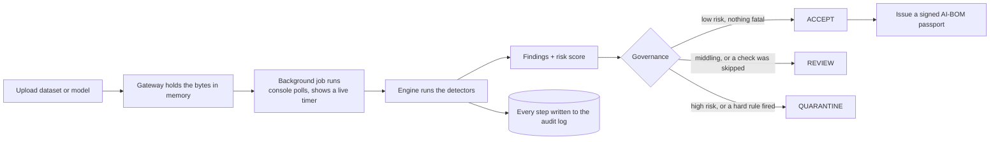
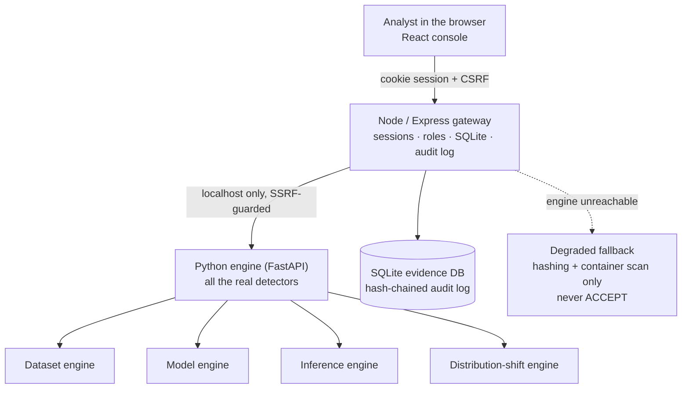
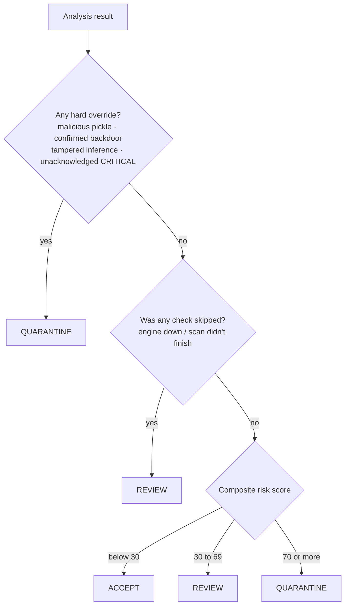
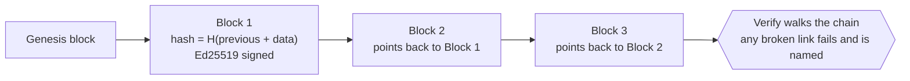

<p align="center">
  
</p>

<p align="center">
  <a href="https://github.com/ekupekuAI/AISecurity26228/releases">
    
  </a>
</p>

<p align="center"><b>▶ Get the app:</b> download <code>TrustVision-Windows.zip</code> from the
<a href="https://github.com/ekupekuAI/AISecurity26228/releases">Releases</a> page, unzip it, and
double-click <code>TrustVision.vbs</code>. Runs fully offline, nothing to install.</p>

<p align="center">
  
  
  
  
  
  
</p>

# TrustVision

**Smart India Hackathon 2026 · Problem Statement SIH26228 · Ministry of Defence · Indian Army (DGIS)**
**Trustworthy Computer-Vision Integrity Assurance for Data, Models and Inference Outputs in Multi-Contributor Pipelines**

---

## The problem

Defence computer-vision pipelines pull training data from many outside contributors, run models
supplied by third-party vendors, and stream live inference results to decision-makers. Every link in
that supply chain can be attacked: poisoned labels, hidden backdoor triggers, near-duplicate flooding,
out-of-distribution blind spots, swapped or trojanised model files, and tampered inference outputs.

SIH26228 asks for a single software layer that inspects all three parts — the **dataset**, the
**model**, and the **inference output** — binds their provenance with cryptography, measures
distribution shift, and returns a clear governance decision with a complete, tamper-proof audit trail.
It must run fully offline on an air-gapped node, with zero cloud or external API dependency.

## What TrustVision is

TrustVision is that layer. It works like a security checkpoint for AI: every incoming dataset, model,
or inference is treated as a zero-trust asset, put through automated inspection, and given one of three
verdicts.

| Verdict | Meaning |
|---|---|
| **ACCEPT** | Risk below 30 and no critical flag. Certified for deployment; a cryptographic seal is issued. |
| **REVIEW** | Risk 30–69, or a check could not be completed. Sent for human analyst triage. |
| **QUARANTINE** | Risk 70 or above, or a hard flag fired (malicious pickle, confirmed backdoor, tampered inference). Asset is isolated. |

Every verdict is backed by evidence, and every action is written to an append-only log that the
database itself cannot edit or delete.

---

## The workflow

You sign in, upload an asset, and the engine runs the checks in the background while the console shows
a live progress timer. When it finishes you get findings, a risk score, and a verdict — and you can
export a signed passport for the asset.



Each engine follows the same shape the problem statement lays out:

**Dataset workflow.** Hash the archive, unpack it in memory, detect the format (COCO / YOLO / image
folders), check for corrupt files, find duplicate flooding, flag flipped labels, screen for backdoor
triggers and out-of-distribution samples, then roll every defect up to the contributor responsible.

**Model workflow.** Hash the file and identify the framework. Audit the serialization *without running
it*. Read the weights and structure. Run a behavioural trigger battery, then optimization-based trigger
inversion. Report the confidence and, honestly, what the scan could and could not cover.

**Inference workflow.** Bind the input hash, model hash, preprocessing config, prediction, timestamp,
and a nonce into one canonical record. Hash it (SHA-256) and sign it (Ed25519). On verification, a
changed field or a bad signature is caught immediately and named.

---

## Architecture

Two programs run on the same machine and talk only over `localhost`:

- A **Node / Express gateway** — the console you log into, the SQLite database, the signed audit log,
  users, roles, and all the security gatekeeping.
- A **Python engine (FastAPI)** — every real detector: the deep-learning checks, the image math, the
  cryptography.



The gateway owns everything durable and everything the browser touches. The engine owns every
judgement and never listens beyond `localhost`. The only outbound call in the whole system is the
gateway reaching its own local engine, and that is locked to loopback and re-checked on every request.
If the engine is off, the gateway keeps serving but drops to a clearly labelled degraded mode that can
never issue an ACCEPT.

---

## The five engines

### 1. Dataset integrity

| Threat | Method |
|---|---|
| Exact duplicate flooding | Byte-identical grouping by SHA-256 |
| Near-duplicate flooding | Perceptual hash (pHash) + BK-tree search, Hamming ≤ 5, confirmed by ResNet-18 embedding cosine > 0.98 |
| Flipped / systematic mislabelling | k-nearest-neighbour cross-check in feature space, with class-pair flow |
| Backdoor triggers | Per-class and whole-corpus residual clustering; recovers and displays the actual trigger patch |
| Out-of-distribution samples | Mahalanobis distance to class centroids (Ledoit–Wolf shrunk covariance) |
| Corrupt files | Real decode check plus magic-byte vs extension match; COCO/YOLO schema validation |
| Unsafe archives | Zip-Slip, decompression bombs, and symlink escape, caught before extraction |
| Bad contributors | Every defect rolled up to a per-source risk score |

### 2. Model integrity

| Threat | Method |
|---|---|
| Malicious pickle | Disassembles the pickle opcodes without executing them, checks every import against an allowlist, and fails closed on a broken or truncated stream (the nullifAI evasion, Feb 2025) |
| Structural trojans | ONNX graph inspection, with a built-in protobuf reader so it works even without the `onnx` package |
| Weight anomalies | NaN/Inf, dead tensors, outlier neurons, near rank-1 spectra |
| Backdoors, by behaviour | A battery of known trigger stamps, scored on how hard and how consistently they push inputs to one class; works on PyTorch and on ONNX via onnxruntime |
| Backdoors, by inversion | Neural Cleanse trigger reverse-engineering, used only to corroborate the behavioural battery. Not available for ONNX, and the report says so rather than skipping silently |

Every model result also states its access mode — `WHITE_BOX`, `GREY_BOX`, `BLACK_BOX`, or `REFUSED` —
so a clean verdict always comes with how deeply the scan could actually see.

### 3. Inference provenance

Binds the input hash, model hash, preprocessing config, prediction, timestamp, and nonce into one
canonical document (RFC 8785), hashes it (SHA-256), and signs it (Ed25519). Verification returns one of
four answers:

| Result | Meaning |
|---|---|
| `VERIFIED` | Hash and signature both hold |
| `TAMPERED` | A bound field changed, and it names which fields |
| `FORGED` | Hash matches but signature does not: someone recomputed the hash without the key |
| `REPLAYED` | Intact, but the nonce was reused, or the same input and model produced a different answer before |

### 4. Distribution shift

Maximum Mean Discrepancy (RBF kernel with a permutation test), plus per-dimension KS and PSI on class
priors. Normal drift is separated from tampering by measuring how concentrated the shift is and whether
it disappears once lighting, contrast, and colour are accounted for. HIGH severity is reserved for
shift that is both real and unexplained.

### 5. Risk, governance, and audit

Findings are fused into a weighted composite risk score, mapped to the ACCEPT / REVIEW / QUARANTINE
triad, and every step is sealed into the audit log. Details in the next two sections.

---

## The decision

Thresholds are fixed by the problem statement: ACCEPT below 30, REVIEW 30–69, QUARANTINE 70 and up.
Some conditions are fatal on their own and are checked before the score, so one catastrophic flaw is
never averaged out by healthy ones.



The decision is per-asset: a malicious model uploaded next to a clean dataset cannot drag the clean one
down. And there is no silent degradation: if the engine is unreachable, the fallback scan is logged,
shown as a banner, and capped at REVIEW.

## The audit log

An append-only log in a single SQLite database. Each entry stores the previous entry's hash and is
signed with Ed25519, so altering an old record breaks every record after it. Database triggers refuse
UPDATE and DELETE on the log table, so even a compromised part of the app cannot rewrite history.
Verification walks the whole chain and points at the first entry that fails. It is tamper-evident by
hash chaining and signatures; it is not a blockchain, and is not described as one.



---

## Accounts, keys, and workspaces

Each operator gets a private workspace. Their uploads, analyses, findings, and dashboard are theirs
alone and never mix with anyone else's. What stays shared is the audit log and the signing key.

On first run the node creates its own Ed25519 signing keys and keeps them in `data/keys/`; the session
secret lives in `data/auth_secret.txt`. Everything the node produces — the evidence database, the keys,
and issued passports — stays inside its own `data/` folder. Back it up to keep your work; delete it to
start clean.

A signed passport carries its own public key and signature inside the file, so it can be verified on
any node, fully offline, by pure cryptography rather than a database lookup. Verification also reports
whether the signer is this node or a different one.

Accounts come from the environment, never hard-coded. Point `AIA_SEED_USERS_FILE` at a JSON file (kept
out of git) or run `npm run seed:users`. Roles range from a read-only observer to a lead engineer, each
with an explicit list of allowed actions.

---

## The pages

| Page | Purpose | What you upload |
|---|---|---|
| Dashboard | Node verdict, risk pillars, open findings, recent log events | Nothing |
| Dataset integrity | Duplicates, label issues, recovered triggers, OOD, contributors | A dataset archive (`.zip`/`.tar`, COCO/YOLO/ImageFolder) or a single image |
| Model integrity | Pickle audit, backdoor battery, Neural Cleanse, weight stats | A model file (`.pt`, `.pth`, `.onnx`, `.ts`, `.safetensors`, `.bin`) |
| Inference provenance | Seal a prediction, then tamper with it and watch verification catch it | Form fields |
| Distribution shift | Compare a baseline image set against an operational one | Two sets of images (descriptors computed in the browser) |
| Audit & reports | Read the log, verify the chain, generate a signed report | Nothing |
| Model passport (AI-BOM) | Issue a passport from an analysis; verify any pasted passport | Passport JSON to verify |
| Live monitoring (Sentinel) | Status board for the read-only sensor agents | Nothing |
| Analytics | Risk trends and breakdown charts from this node's records | Nothing |
| Settings | Engine endpoint, signing key info, roles, password change | Nothing |
| Methodology | Plain explainer of each detector | Nothing |

---

## Does it catch things?

The detectors are scored against a labelled corpus built from real CIFAR-10 data with a genuinely
fine-tuned backdoor (99.99% attack success, 85.9% clean accuracy — high enough to pass ordinary
validation, which is what makes it dangerous). Accuracy is measured on a test split the models never
saw.

| Asset | Ground truth | Verdict |
|---|---|---|
| `backdoored_model.pth` | BadNets corner trigger → class 0 | DETECTED. The behavioural battery drives ~99% of inputs to class 0. QUARANTINE. |
| `clean_model.pth` | Clean, ~86% accuracy | Not flagged as a backdoor. Low risk, ACCEPT. |
| `malicious_model.pth` | `os.system` via pickle | DETECTED. Risk 100, never deserialised. |
| `nullifai_model.pth` | Payload behind a broken stream | DETECTED. Risk 100. |
| `backdoored_model.onnx` | Same backdoor, ONNX | DETECTED via onnxruntime; trigger inversion declared unavailable (no ONNX gradients). |
| `poisoned_corpus.zip` | 36 triggers, 34 floods, 28 flips | DETECTED. Triggers recovered; the hostile contributor outranks the clean one. |
| `clean_corpus.zip` | Clean CIFAR-10 | ACCEPT. No trigger clusters. |

Reproduce it: `python ml-engine/scripts/make_demo_assets.py`, then
`python -m pytest ml-engine/tests/test_ground_truth.py -v`.

---

## Technology stack

| Layer | Technology | Version |
|---|---|---|
| Frontend | React + React DOM | 19.3.0 |
| | Tailwind CSS (+ Vite plugin) | 4.1.14 |
| | Radix UI, Motion, Recharts, lucide-react | current |
| Gateway | Node.js | ≥ 22.5 |
| | Express | 4.22.3 |
| | `node:sqlite` (embedded database) | built-in |
| | multer, zod, dotenv | current |
| ML engine | Python | ≥ 3.10 |
| | FastAPI + uvicorn | ≥ 0.115 / ≥ 0.30 |
| | PyTorch + torchvision (CPU is enough) | ≥ 2.2 / ≥ 0.17 |
| | NumPy, SciPy, scikit-learn | ≥ 1.26 / ≥ 1.11 / ≥ 1.4 |
| | Pillow | ≥ 10.3 |
| | cryptography (Ed25519) | ≥ 42 |
| | onnx / onnxruntime (optional) | ≥ 1.16 / ≥ 1.18 |
| Build / test | Vite, esbuild, tsx, TypeScript, pytest | current |

Signing (Ed25519), hashing (SHA-256), password hashing (scrypt), and RFC 8785 canonicalisation use
Node's built-in `crypto` and Python's `cryptography`. No home-made cryptography.

---

## Running it

### Windows app (zero install, fully offline)

The whole system is packaged into one self-contained folder that carries its own Python + PyTorch
engine and its own Node runtime. It runs on any 64-bit Windows 10/11 machine with nothing to install
and nothing touching the internet.

1. Unzip `TrustVision-Windows.zip` anywhere, or build it (below).
2. Double-click `TrustVision.vbs`.
3. On the first launch Windows may show "Windows protected your PC" (the app is unsigned): choose
   **More info → Run anyway**.
4. It opens in its own window after a few seconds.
5. Sign in as **`admin` / `TrustVision#2026`**, or use the no-password read-only session. Change the
   password in Settings.
6. To stop it, double-click `Stop TrustVision.vbs`.

Data stays in the `data/` folder next to `TrustVision.vbs`. Needs about 2 GB of free RAM for model
analysis. Build the bundle from source with:

```powershell
powershell -ExecutionPolicy Bypass -File deploy\windows\build-windows-app.ps1
```

### From source (development)

Needs Node.js 22.5+ and Python 3.10+.

```bash
npm install
python -m pip install -r ml-engine/requirements.txt
```

Stage the reference backbone once (needs network; then copy the file to the offline node). Skip it and
embedding checks run in a weaker mode that says so:

```bash
python ml-engine/scripts/provision_backbone.py
```

Start the engine, then the console, in two terminals:

```bash
npm run ml
npm run dev
```

Open <http://127.0.0.1:3000>. If you set `AIA_BOOTSTRAP_USER` / `AIA_BOOTSTRAP_PASSWORD`, those are your
admin login. If you do not, the first boot prints a one-time random password for `assurance.lead` to
the terminal, which must be changed at first login. Create team accounts with a gitignored
`seed-users.json` (see `seed-users.example.json`) and `npm run seed:users`.

---

## Tests

```bash
npm test          # Node / gateway suite (73 tests)
npm run test:py   # Python engine suite (167 tests)
npm run verify    # typecheck plus both suites
```

The Node suite covers canonicalisation, per-asset governance, audit-chain tamper-evidence, passport
verification, persistence, and per-user isolation. The Python suite covers the detectors, provenance,
shift, and security (pickle and archive guards). The gateway↔engine integration test and the CIFAR-10
ground-truth scoring run when their prerequisites are present and skip otherwise.

---

## Limitations

- It does not detect clean-label poisoning (Poison Frogs, Sleeper Agent) or input-aware / warping
  backdoors (WaNet, BppAttack) from imagery. These are declared out of scope.
- Neural Cleanse cannot see all-to-all backdoors, and on its own it is not trusted; it only corroborates
  the behavioural battery.
- The degraded fallback is shallow by design: with the engine down you get hashing, container checks,
  and a basic pickle scan, and the result is always capped at REVIEW.
- It is a single node. The audit log is one signed SQLite chain, not a distributed ledger.
- Authentication is local only: scrypt passwords and server-side sessions. No OAuth/SSO, no MFA.
- ONNX and safetensors get the behavioural battery but no gradient-based trigger inversion; full
  white-box certification needs a PyTorch checkpoint.

---

## Project layout

```
server/            Node gateway
  db/              schema · repositories · signed audit ledger
  security/        passwords · sessions · CSRF · roles · keyring · validation
  provenance/      RFC 8785 canonicalisation · sealing · verification
  routes/          auth · analysis · inference · governance · aibom · system

ml-engine/         Python assurance engine
  security/        pickle opcode audit · archive guards
  vision/          imaging · phash · embeddings · duplicates · label noise · triggers · ood
  ingest/          COCO/YOLO parsers · contributor attribution
  modelscan/       torch · onnx · weight stats · behavioural battery · neural cleanse
  provenance/      canonicalisation · Ed25519 keyring · replay guard
  analyzers/       dataset · model · shift · risk · coverage

src/               React 19 console (Tailwind v4, Radix, Motion, Recharts)
scripts/           seed-users.ts · admin.ts (local operator CLI)
deploy/            Dockerfile · docker-compose · systemd unit
  windows/         build-windows-app.ps1 · launcher templates (the zero-install app)
```

---

## References

- Gu et al., *BadNets* (2017); Chen et al., *Blended* (2017); Nguyen & Tran, *WaNet* (ICLR 2021)
- Wang et al., *Neural Cleanse* (IEEE S&P 2019); Tran et al., *Spectral Signatures* (2018)
- Lee et al., *Detecting OOD Samples* (NeurIPS 2018); Northcutt et al., *Confident Learning* (JAIR 2021)
- Gretton et al., *A Kernel Two-Sample Test* (JMLR 2012)
- RFC 8785 (JCS); RFC 8032 (Ed25519); CWE-502, CWE-22, CWE-409; MITRE ATLAS AML.T0010
- ReversingLabs, *nullifAI* malicious ML models on Hugging Face (February 2025)
