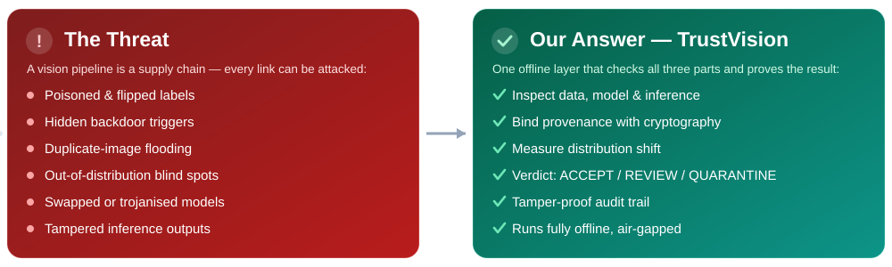
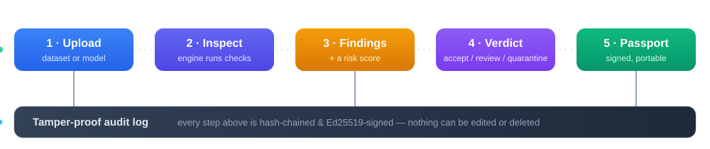
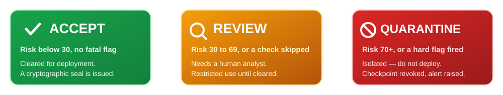
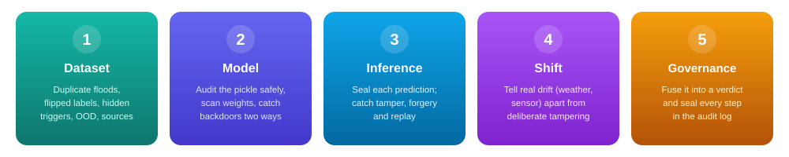
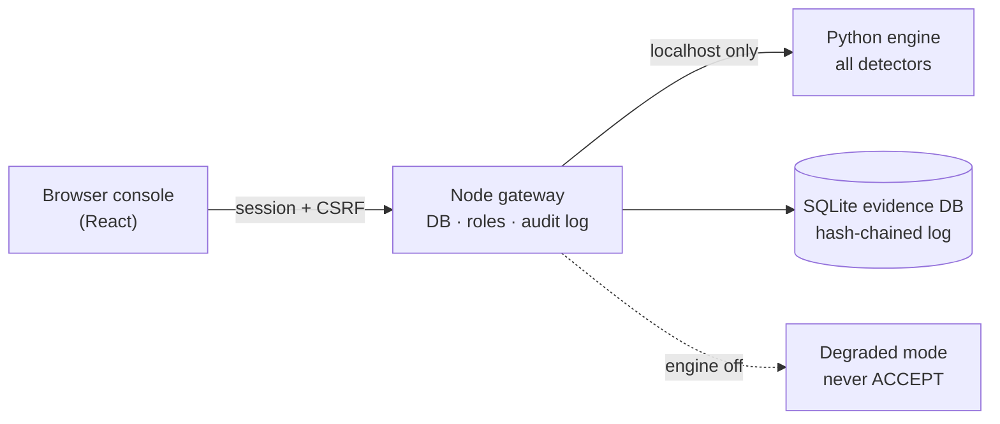

<p align="center">
  
</p>

<p align="center">
  <a href="https://github.com/ekupekuAI/AISecurity26228/releases">
    
  </a>
</p>

<p align="center">
  
</p>

> [!WARNING]
> **There is no public / hosted demo link — and that is by design.** TrustVision is a defence
> **air‑gapped, offline** system, so it deliberately does not run on the public web. To try it,
> **download the app from the [Releases](https://github.com/ekupekuAI/AISecurity26228/releases) page**
> and **follow the install &amp; configure steps at the [bottom of this README](#running-it)**.

<p align="center"><b>▶ Get the app:</b> download <code>TrustVision-Setup.exe</code> from the
<a href="https://github.com/ekupekuAI/AISecurity26228/releases">Releases</a> page, double-click it to
self-extract, then open the <code>TrustVision</code> folder and run <code>TrustVision.vbs</code>
(or <code>Add to Desktop.vbs</code> for a desktop icon). Runs fully offline, nothing to install.<br>
<b>Demo login:</b> <code>admin</code> / <code>TrustVision#2026</code> &nbsp;·&nbsp; or the no-password read-only session.</p>

<p align="center">
  
</p>

<p align="center">
  
  
  
  
  
  
</p>

<div align="center">

<details>
<summary><b>👥 &nbsp;Click to view the team &amp; contributions&nbsp; 👥</b></summary>

<br>

<table>
<tr><th>#</th><th>Member</th><th>Role &amp; Contribution</th></tr>
<tr><td align="center">1</td><td><b>Ekansh</b></td><td>Team Leader · Integrator &amp; Developer</td></tr>
<tr><td align="center">2</td><td><b>Shivasai</b></td><td>Co-Developer · Backend Integration</td></tr>
<tr><td align="center">3</td><td><b>Snehitha</b></td><td>Research &amp; Documentation · Complete Research</td></tr>
<tr><td align="center">4</td><td><b>Meheq</b></td><td>Ideology &amp; Documentation · Co-Researcher</td></tr>
<tr><td align="center">5</td><td><b>Siddharth</b></td><td>UI/UX · Deep Researcher &amp; Architect</td></tr>
<tr><td align="center">6</td><td><b>Sheshir</b></td><td>Quality Assurance &amp; Testing · End-to-End</td></tr>
</table>

<sub><i>Team Patriots · Smart India Hackathon 2026 · PS SIH26228</i></sub>

</details>

</div>

# TrustVision

**Trustworthy Computer-Vision Integrity Assurance for Data, Models and Inference Outputs**

TrustVision checks one thing that is hard to answer: **can you trust this computer-vision
pipeline?** Not just the model file, but the **data** it learned from, the **model** itself, and the
**predictions** it makes. You hand it an asset, it runs a full set of checks, and it gives you one
clear answer — with all the proof written to a log that cannot be edited.

---

## The problem

<p align="center">
  
</p>

Defence vision systems get their data from many outside contributors, use models from third-party
vendors, and send live results to decision-makers. Any link can be poisoned. **SIH26228** asks for a
single, offline software layer that inspects the data, the model, and the inference output, ties them
together with cryptography, and gives an evidence-backed decision with a full audit trail.

---

## How it works

<p align="center">
  
</p>

You sign in, upload a dataset or a model, and the checks run in the **background** while the screen
shows a live timer — so a big file never looks frozen. When it finishes you get findings, a risk
score, and a verdict, and you can export a signed passport. Every step is written to the audit log.

---

## The decision

<p align="center">
  
</p>

Thresholds are fixed by the problem statement. Two rules keep it honest: the decision is **per-asset**
(a bad model next to a clean dataset can't drag the clean one down), and there is **no silent
downgrade** — if a check could not run, the result is capped at REVIEW and says so. A gap is never an
ACCEPT.

---

## What it checks — the five engines

<p align="center">
  
</p>

### 1 · Dataset integrity

| Threat | Method |
|---|---|
| Exact duplicate flooding | Byte-identical grouping by SHA-256 |
| Near-duplicate flooding | Perceptual hash (pHash) + BK-tree search, confirmed by ResNet-18 embedding cosine > 0.98 |
| Flipped / systematic mislabelling | k-nearest-neighbour cross-check in feature space |
| Backdoor triggers | Residual clustering; recovers and **shows the actual trigger patch** |
| Out-of-distribution samples | Mahalanobis distance to class centroids |
| Corrupt files | Real decode check + magic-byte vs extension; COCO/YOLO schema checks |
| Unsafe archives | Zip-Slip, decompression bombs, symlink escape — caught before extraction |
| Bad contributors | Every defect rolled up to a per-source risk score |

### 2 · Model integrity

| Threat | Method |
|---|---|
| Malicious pickle | Reads the pickle opcodes **without running them**; fails closed on a broken stream (the nullifAI trick) |
| Structural trojans | ONNX graph inspection (built-in protobuf reader, works without the `onnx` package) |
| Weight anomalies | NaN/Inf, dead tensors, outlier neurons |
| Backdoors, by behaviour | A battery of trigger stamps, scored on how consistently they push inputs to one class (PyTorch and ONNX) |
| Backdoors, by inversion | Neural Cleanse trigger search — used only to **confirm** the behavioural result |

Every model result also states how deeply it could look: `WHITE_BOX`, `GREY_BOX`, `BLACK_BOX`, or `REFUSED`.

### 3 · Inference provenance

Binds the input hash, model hash, preprocessing config, prediction, timestamp, and a nonce into one
canonical record (RFC 8785), hashes it (SHA-256), and signs it (Ed25519). Verification returns
`VERIFIED`, `TAMPERED` (names the changed fields), `FORGED` (hash recomputed without the key), or
`REPLAYED`.

### 4 · Distribution shift

Maximum Mean Discrepancy (RBF kernel + permutation test), plus per-dimension KS and PSI. Normal drift
(weather, lighting, sensor) is separated from tampering by how concentrated the shift is and whether it
survives colour/contrast correction.

---

## Architecture

Two programs run on the same machine and talk only over `localhost`: a **Node/Express gateway** (the
console, database, and signed audit log) and a **Python engine** (all the real detectors). The engine
never listens beyond `localhost`, and the only outbound call in the system is the gateway reaching its
own local engine.



## The audit log

An append-only log in one SQLite database. Each entry stores the previous entry's hash and is signed
with Ed25519, so changing an old record breaks every record after it. Database triggers refuse UPDATE
and DELETE on the log, so even a compromised part of the app cannot rewrite history. It is
tamper-evident by design — not a blockchain, and not described as one.

## Keys and workspaces

Each operator gets a private workspace; their uploads and dashboard never mix with anyone else's. The
audit log and signing key are shared, which is what makes passports portable: a signed passport carries
its **own public key** inside the file, so any node can verify it offline. On first run the node
generates its keys into `data/keys/` and its session secret into `data/auth_secret.txt`; everything
you produce stays in the local `data/` folder.

---

## The pages

| Page | Purpose |
|---|---|
| Dashboard | Node verdict, risk pillars, open findings, recent log events |
| Dataset integrity | Duplicates, label issues, recovered triggers, OOD, contributors |
| Model integrity | Pickle audit, backdoor battery, Neural Cleanse, weight stats |
| Inference provenance | Seal a prediction, then tamper with it and watch verification catch it |
| Distribution shift | Compare a baseline image set against an operational one |
| Audit & reports | Read the log, verify the chain, generate a signed report |
| Model passport (AI-BOM) | Issue a passport; verify any pasted passport |
| Live monitoring (Sentinel) | Status board for the read-only sensor agents |
| Analytics | Risk trends and breakdown charts from this node's records |
| Settings / Methodology | Engine status, roles, password change; plain detector explainers |

---

## Does it catch things?

Scored against a labelled corpus built from real CIFAR-10 data with a genuinely fine-tuned backdoor
(99.99% attack success, 85.9% clean accuracy — high enough to pass ordinary validation).

| Asset | Ground truth | Verdict |
|---|---|---|
| `backdoored_model.pth` | BadNets corner trigger → class 0 | **DETECTED** → QUARANTINE |
| `clean_model.pth` | Clean, ~86% accuracy | Not a backdoor → ACCEPT |
| `malicious_model.pth` | `os.system` via pickle | **DETECTED**, risk 100, never deserialised |
| `nullifai_model.pth` | Payload behind a broken stream | **DETECTED**, risk 100 |
| `backdoored_model.onnx` | Same backdoor, ONNX | **DETECTED** via onnxruntime |
| `poisoned_corpus.zip` | 36 triggers, 34 floods, 28 flips | **DETECTED**, triggers recovered |
| `clean_corpus.zip` | Clean CIFAR-10 | ACCEPT |

Reproduce it: `python ml-engine/scripts/make_demo_assets.py`, then
`python -m pytest ml-engine/tests/test_ground_truth.py -v`.

---

## Technology stack

| Layer | Technology |
|---|---|
| Frontend | React 19, Tailwind CSS v4, Radix UI, Motion, Recharts |
| Gateway | Node.js ≥ 22.5, Express, built-in `node:sqlite`, multer, zod |
| ML engine | Python ≥ 3.10, FastAPI + uvicorn, PyTorch + torchvision (CPU is enough), NumPy/SciPy/scikit-learn, Pillow, cryptography (Ed25519), onnx/onnxruntime |
| Build / test | Vite, esbuild, tsx, TypeScript, pytest |

Signing (Ed25519), hashing (SHA-256), password hashing (scrypt), and RFC 8785 canonicalisation use
Node's built-in `crypto` and Python's `cryptography`. No home-made cryptography.

---

## Running it

### Windows app (zero install, fully offline)

The whole system is packaged into one self-contained folder with its own Python + PyTorch and its own
Node runtime. It runs on any 64-bit Windows 10/11 machine with nothing to install and nothing touching
the internet.

1. Download **`TrustVision-Setup.exe`** from the [Releases](https://github.com/ekupekuAI/AISecurity26228/releases) page.
   (Google may warn "can't scan large file" → **Download anyway**; that is normal for a large file.)
2. Double-click the `.exe` → choose a folder → it **self-extracts** (one file, fast — no unzipping thousands of files).
3. Open the extracted **`TrustVision`** folder. *(Optional: double-click **`Add to Desktop.vbs`** to put a TrustVision icon on your Desktop.)*
4. Double-click **`TrustVision.vbs`** (or the Desktop icon) to start.
5. First launch only, Windows may say "Windows protected your PC" (the app is unsigned): **More info → Run anyway**.
6. The window opens in a few seconds. On the first run the engine keeps loading for a minute or two
   (PyTorch is large and your antivirus scans it once); you can sign in straight away, and the top bar
   shows when analysis is ready.
7. **Demo login:** sign in as **`admin` / `TrustVision#2026`**, or use the no-password read-only session.
   Change the password in Settings.
8. To stop it, double-click **`Stop TrustVision.vbs`**.

Build the bundle from source:

```powershell
powershell -ExecutionPolicy Bypass -File deploy\windows\build-windows-app.ps1
```

### From source (development)

Needs Node.js 22.5+ and Python 3.10+.

```bash
npm install
python -m pip install -r ml-engine/requirements.txt
```

Stage the reference backbone once (needs network; then copy it to the offline node):

```bash
python ml-engine/scripts/provision_backbone.py
```

Start the engine, then the console, in two terminals:

```bash
npm run ml
npm run dev
```

Open <http://127.0.0.1:3000>. If you set `AIA_BOOTSTRAP_USER` / `AIA_BOOTSTRAP_PASSWORD`, those are
your admin login; otherwise the first boot prints a one-time password to the terminal. Create team
accounts with a gitignored `seed-users.json` (see `seed-users.example.json`) and `npm run seed:users`.

---

## Tests

```bash
npm test          # Node / gateway suite (73 tests)
npm run test:py   # Python engine suite (167 tests)
npm run verify    # typecheck plus both suites
```

---

## Limitations

- Does not detect clean-label poisoning (Poison Frogs, Sleeper Agent) or input-aware / warping
  backdoors (WaNet, BppAttack) from imagery — declared out of scope.
- Neural Cleanse only confirms the behavioural battery; it is not trusted on its own.
- The degraded fallback (engine off) is shallow by design and always capped at REVIEW.
- Single node — the audit log is one signed SQLite chain, not a distributed ledger.
- Authentication is local only: scrypt passwords and server-side sessions. No OAuth/SSO, no MFA.
- ONNX and safetensors get the behavioural battery but no gradient-based trigger inversion.

---

## Project layout

```
server/            Node gateway (db · security · provenance · routes)
ml-engine/         Python engine (security · vision · ingest · modelscan · provenance · analyzers)
src/               React 19 console
deploy/            Docker · systemd · windows/ (the zero-install app builder)
docs/              banner and section graphics
```

---

<p align="center">
  
</p>

## References

Each entry below is a method or standard **actually implemented** in the engine — the file that uses it is named alongside it.

**Backdoor detection** — `modelscan/`, `vision/triggers.py`
- Gu et al., [*BadNets*](https://arxiv.org/abs/1708.06733) (2017) — the corner-patch trigger family the behavioural battery replays.
- Chen et al., [*Targeted Backdoor Attacks (Blended)*](https://arxiv.org/abs/1712.05526) (2017) — the blended-overlay probe in the battery.
- Wang et al., [*Neural Cleanse*](https://doi.org/10.1109/SP.2019.00031) (IEEE S&P 2019) — per-class trigger inversion (`neural_cleanse.py`), used only to corroborate the battery.
- MITRE ATLAS [*AML.T0010 — ML Supply-Chain Compromise*](https://atlas.mitre.org/techniques/AML.T0010) — the threat the model engine maps to.

**Dataset integrity** — `analyzers/dataset_analyzer.py`, `vision/`, `ingest/`
- Northcutt et al., [*Confident Learning*](https://arxiv.org/abs/1911.00068) (JAIR 2021) — the k-NN clean-feature basis for label-manipulation detection.
- Lee et al., [*A Simple Unified Framework for Detecting OOD Samples*](https://arxiv.org/abs/1807.03888) (NeurIPS 2018) — Mahalanobis distance to class centroids.
- Ledoit & Wolf, *A Well-Conditioned Estimator for Large-Dimensional Covariance Matrices* (J. Multivariate Analysis, 2004) — the shrunk pooled covariance the OOD score uses.
- Perceptual hashing (pHash) indexed in a BK-tree — sub-linear near-duplicate flooding detection.

**Distribution shift** — `analyzers/shift_analyzer.py`
- Gretton et al., [*A Kernel Two-Sample Test*](https://jmlr.org/papers/v13/gretton12a.html) (JMLR 2012) — Maximum Mean Discrepancy with a permutation test.

**Serialisation, provenance & security** — `security/pickle_audit.py`, `provenance/`, `server/`
- ReversingLabs, *nullifAI* disclosure (2025) — the broken-pickle-stream evasion the opcode audit fails closed on.
- [RFC 8785](https://www.rfc-editor.org/rfc/rfc8785) — JSON Canonicalization Scheme (JCS), the exact bytes that get hashed and signed.
- [RFC 8032](https://www.rfc-editor.org/rfc/rfc8032) — Ed25519 signatures for the audit ledger and passports.
- [RFC 7914](https://www.rfc-editor.org/rfc/rfc7914) — scrypt password hashing (N = 2¹⁷).
- CWE [-502](https://cwe.mitre.org/data/definitions/502.html) (unsafe deserialisation), [-22](https://cwe.mitre.org/data/definitions/22.html) (path traversal), [-409](https://cwe.mitre.org/data/definitions/409.html) (decompression bomb), [-59](https://cwe.mitre.org/data/definitions/59.html) (symlink following) — the upload/archive weaknesses guarded against.

*Out of scope (see Limitations):* clean-label poisoning (Poison Frogs, Sleeper Agent) and input-aware/warping backdoors (Nguyen & Tran, *WaNet*, ICLR 2021; *BppAttack*) — acknowledged, not claimed.
